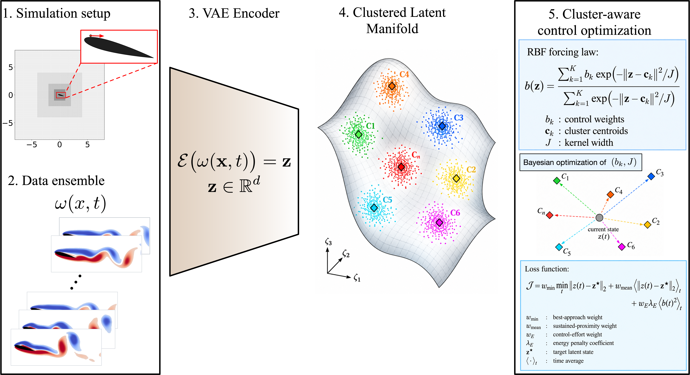

# Cluster-based feedback control of separated-flow transients in a learned latent space

Code, trained latent-space artifacts, optimized control laws, and analysis accompanying the study:

**Khalid Rafiq and Aditya G. Nair**  
Department of Mechanical Engineering, University of Nevada, Reno

<p align="center">
  
</p>

<p align="center">
  <em>
  Unforced baseline (left), C₀ hold control (center), and C₆ escape control (right).
  The animation shows the evolving latent state, instantaneous vorticity field,
  and closed-loop actuation history.
  </em>
</p>

## Overview

This repository contains the analysis and data products for cluster-based feedback control of two-dimensional separated flow over a deeply stalled NACA0015 airfoil at

$$
Re = 500, \qquad \alpha = 15^\circ .
$$

A variational autoencoder (VAE) maps vorticity fields to an eight-dimensional latent representation. The actuation-enriched latent ensemble is partitioned into nine recurring macrostates using $k$-means clustering.

A continuous feedback law assigns an actuation amplitude $b_k$ to each macrostate and smoothly interpolates these actions throughout the learned latent space.

Two qualitatively different control behaviours emerge:

- **C₀ hold:** nearly steady actuation arrests the natural vortex-shedding dynamics and maintains a comparatively attached, actuation-supported state.
- **C₆ escape:** the optimized feedback first establishes the attached C₀ state, releases the flow so that the intrinsic separation transient carries it through C₆, and subsequently restores actuation to recapture C₀.

The resulting C₆-targeting dynamics form an **arrest–release–recapture cycle**, in which the controller combines active stabilization with passive evolution along the natural separation transient.


## Cluster-based latent feedback

For each vorticity field $\omega(\mathbf{x},t)$, the trained encoder provides the deterministic latent state

```math
\mathbf{z}(t)
=
\mathcal{E}_{\mu}\left[\omega(\mathbf{x},t)\right]
\in \mathbb{R}^{8}.
```

Here, $\mathcal{E}_{\mu}$ denotes the deterministic encoder-mean mapping.

The actuation-enriched latent ensemble is partitioned into $K=9$ recurring macrostates with centroids

```math
\mathbf{c}_0,\mathbf{c}_1,\ldots,\mathbf{c}_8.
```

Each macrostate is assigned an actuation amplitude $b_k$. Rather than switching discontinuously between cluster actions, the feedback is smoothly interpolated throughout the latent space using normalized Gaussian radial-basis functions:

```math
b(\mathbf{z})
=
\frac{
\sum_{k=0}^{K-1}
b_k
\exp\left(
-\frac{\|\mathbf{z}-\mathbf{c}_k\|_2^2}{2\sigma^2}
\right)
}{
\sum_{k=0}^{K-1}
\exp\left(
-\frac{\|\mathbf{z}-\mathbf{c}_k\|_2^2}{2\sigma^2}
\right)
}.
```

Here, $\sigma$ controls the interpolation width. The cluster amplitudes $b_k$ and $\sigma$ are optimized for a prescribed target state while penalizing actuation effort.

<p align="center">
  
</p>

## Learned macrostates

The nine clusters provide a coarse-grained description of the actuated flow dynamics. They should be interpreted as recurring regions of a continuous latent trajectory rather than as isolated dynamical states.

<p align="center">
  
</p>

The macrostates organize into three characteristic groups:

- **Natural shedding family:** $C_1$, $C_2$, $C_3$, $C_5$, and $C_8$ represent different phases and downstream positions of the naturally shed vortical structures.
- **Attached state:** $C_0$ corresponds to a comparatively attached configuration with a thin, elongated wake.
- **Separated branch:** $C_4$, $C_6$, and $C_7$ describe states associated with the roll-up and convection of a large-scale vortical structure over the suction side.

The unforced trajectory remains within the shedding family, while actuation provides access to regions of latent space that are not occupied by the natural limit cycle. The contrasting states $C_0$ and $C_6$ are used as the two control targets examined in this study.


## Repository contents

| Path | Description |
| --- | --- |
| `notebooks/01_vae_analysis.ipynb` | VAE reconstruction, latent-space analysis, clustering diagnostics, and macrostate visualization |
| `notebooks/02_control_analysis.ipynb` | Closed-loop control analysis, residence times, transition statistics, and open-loop arrest/release/recapture probes |
| `notebooks/03_make_gifs.ipynb` | Generation of the latent-space control animations |
| `src/vae_model.py` | Plain and residual convolutional VAE architectures |
| `src/functions.py` | Data preprocessing and radial-basis feedback utilities |
| `artifacts/` | Compact learned quantities including latent states, cluster centroids, labels, aerodynamic statistics, and the fitted UMAP transformation |
| `control_laws/` | Optimized control-law parameters for the $C_0$ hold and $C_6$ escape cases |
| `input/` | Immersed-boundary / solver input files used for the NACA0015 configuration |
| `gifs/` | Individual animations for the baseline, hold, and escape trajectories |
| `assets/` | Figures and animations used on this project page |
| `data/` | Documentation for the large CFD snapshot data distributed separately |


## Installation and usage

The analysis was developed with Python 3.10.

Install the required Python packages with

```bash
pip install -r requirements.txt
```

The notebooks are organized in the approximate order of the analysis:

1. `notebooks/01_vae_analysis.ipynb` — VAE reconstruction, latent-space analysis, clustering diagnostics, and macrostate visualization.
2. `notebooks/02_control_analysis.ipynb` — closed-loop control analysis, residence times, transition statistics, and arrest–release–recapture probes.
3. `notebooks/03_make_gifs.ipynb` — generation of the latent-space control animations.

Large CFD snapshot datasets and the trained residual VAE checkpoint are distributed separately. See the section below and [`data/README.md`](data/README.md) for details.


## Data and pretrained model

The large CFD snapshot datasets used to construct the actuation-enriched ensemble are not stored directly in this repository because of their size.

The repository includes the compact quantities required for the latent-space and control analysis, including:

- the eight-dimensional latent states,
- the $K=9$ cluster centroids and labels,
- cluster-level aerodynamic quantities,
- the fitted three-dimensional UMAP transformation,
- and the optimized $C_0$ and $C_6$ feedback-control laws.

The trained residual VAE checkpoint (`best_ResidualVAE_d8.pth`) is also distributed separately because the file is approximately 170 MB and exceeds GitHub's normal single-file limit.

The raw CFD data and trained model checkpoint will be made available through a permanent archival release. A DOI and download link will be added here when the archive is published.

See [`data/README.md`](data/README.md) for additional information.


## Citation

If you use this repository, please cite the associated work:

**Khalid Rafiq and Aditya G. Nair**,  
*Cluster-based feedback control of separated-flow transients in a learned latent space.*

A permanent paper citation and DOI will be added upon publication.


## License

This project is released under the [MIT License](LICENSE).
